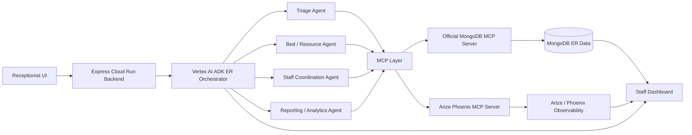

# Rapid Handoff

Rapid Handoff: an multi agent system that coordinates ER triage, bed assignment, and staff dispatch in real time.

Made by Laasya Aki and Hana Benko for the Google Cloud Rapid Agent Hackathon in May and June of 2026.

## ER operations orchestrator

The TypeScript ADK agent in
`backend/src/agents/orchestrator_agent/agent.ts` routes operational questions
to tools for census, bottlenecks, staffing, bed capacity, and shift briefings.

1. Copy `.env.example` to `.env` and set the project and MongoDB values.
2. Enable the Vertex AI API and authenticate with Application Default Credentials:
   `gcloud auth application-default login`
3. Install dependencies with `pnpm install`.
4. Start the ADK development UI with `pnpm agent:dev`.

No Gemini API key is used. `GOOGLE_GENAI_USE_VERTEXAI=TRUE` selects Vertex AI.

## Node.js backend

The Express backend wraps the existing ADK agent without duplicating its
orchestration logic.

```bash
corepack pnpm dev
corepack pnpm typecheck
corepack pnpm test
corepack pnpm build
corepack pnpm start
```

Routes:

- `GET /health`
- `GET /operations/status`
- `POST /agent/orchestrate`
- `POST /tools/census`
- `POST /tools/bottlenecks`
- `POST /tools/staffing`
- `POST /tools/beds`
- `POST /tools/briefing`

See [docs/cloud-run.md](docs/cloud-run.md) for the staged Cloud Run deployment.

## Frontend MVP

The React/Vite demo UI lives in `frontend/`. It includes the receptionist
intake form, delegated workflow summary, and a read-only bed/staff status view.

Set the allowed local frontend origin in the root `.env`:

```bash
FRONTEND_ORIGIN=http://localhost:5173
```

Copy `frontend/.env.example` to `frontend/.env` when the backend URL differs
from the default:

```bash
VITE_API_BASE_URL=http://localhost:8080
```

Run the backend and frontend in separate terminals:

```bash
corepack pnpm dev
```

```bash
corepack pnpm frontend:dev
```

Open `http://localhost:5173`. The intake form sends structured workflow input
to `POST /agent/orchestrate`; after completion, the page refreshes
`GET /operations/status` to show current MongoDB-backed bed and staff state.

Frontend validation:

```bash
corepack pnpm frontend:typecheck
corepack pnpm frontend:build
```

## Phoenix tracing

The production `POST /agent/orchestrate` path now emits OpenTelemetry spans for
the ER workflow and exports them through Phoenix/Arize OTLP when tracing is
configured. Phoenix MCP is used only to inspect those traces after they are
written.

Workflow spans:

- `er.workflow.orchestration.request_received`
- `er.workflow.patient_intake`
- `er.workflow.bed_lookup`
- `er.workflow.bed_assignment`
- `er.workflow.staff_lookup`
- `er.workflow.staff_assignment`
- `er.workflow.orchestration.response`

Required environment variables:

```bash
# Phoenix MCP inspection
PHOENIX_API_KEY=<phoenix-api-key>
PHOENIX_BASE_URL=https://app.phoenix.arize.com
PHOENIX_PROJECT=<phoenix-project-name>

# OTEL export for real traces
PHOENIX_COLLECTOR_ENDPOINT=<phoenix-otlp-endpoint>
```

Supported aliases for OTEL export are also available:

```bash
ARIZE_TRACING_ENDPOINT=<otlp-endpoint>
ARIZE_API_KEY=<phoenix-or-arize-api-key>
ARIZE_PROJECT_NAME=<phoenix-project-name>
```

Trace attributes intentionally exclude raw patient names, notes, and free-form
complaints. The workflow records operational metadata such as triage level, age
bucket, bed type, staff counts, tool counts, and hashed patient references.

To verify recent traces through the official Phoenix MCP server:

```bash
corepack pnpm verify:phoenix
```

The verification command assumes at least one recent production orchestration
request has already run against a tracing-enabled backend. It queries Phoenix
MCP for recent traces and confirms the expected ER workflow span names exist in
one trace.

## Architecture



MCP details located in [docs/architecture.md](docs/architecture.md), agent
definitions located in [docs/agents.md](docs/agents.md), and tool schemas are in
[docs/mcp-tools.md](docs/mcp-tools.md).

## Critical Patient Demo

Run the deterministic Phase 3 workflow without MongoDB, Phoenix, Vertex AI, or
Google Cloud credentials:

```bash
pnpm demo:critical-patient
```

The scenario routes “New critical patient has arrived” through triage,
bed/resource management, staff coordination, and reporting/analytics. Mock MCP
adapters validate the same five MCP tool schemas used by the integration layer.
The printed JSON includes the ESI level, care pathway, assigned bed, estimated
wait, assigned nurse and doctor, staff alert, dashboard summary, and trace event
ID.

Live MCP mode is documented in
[docs/live-integration.md](docs/live-integration.md).

## MongoDB MCP smoke test

The live smoke command launches the pinned local MongoDB MCP server, seeds only
`SMOKE-MCP-*` records, runs patient intake plus bed and staff assignment through
the same production MongoDB repository used by the ADK workflow tools, verifies
the resulting MongoDB state, and removes the test records.

Set these values in `.env`:

```bash
MONGODB_URI=<your-mongodb-connection-string>
MDB_MCP_READ_ONLY=false
MCP_SMOKE_DATABASE=er_system_smoke
```

Then run:

```bash
pnpm smoke:mcp
```

The smoke database defaults to `er_system_smoke` so normal ER records are not
touched. Set `MCP_SMOKE_KEEP_DATA=true` to retain the namespaced records for
inspection; rerun with the same `MCP_SMOKE_RUN_ID` and `MCP_SMOKE_KEEP_DATA=false`
to clean them up. `MCP_SMOKE_INDEX_CHECK=false` is scoped to this test because a
fresh smoke database may not have indexes yet. Each MCP call has a 30-second
deadline by default; adjust `MCP_SMOKE_TIMEOUT_MS` when connecting to a slower
Atlas cluster.
