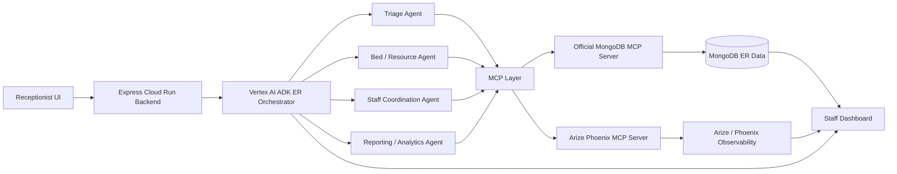

# Rapid Handoff

Rapid Handoff: an multi agent system that coordinates ER triage, bed assignment, and staff dispatch in real time.

Made by Laasya Aki and Hana Benko for the Google Cloud Rapid Agent Hackathon in May and June of 2026.

## ER operations orchestrator

The TypeScript ADK agent in
`backend/src/agents/orchestrator_agent/agent.ts` routes operational questions
to tools for census, bottlenecks, staffing, bed capacity, and shift briefings.

1. Copy `.env.example` to `.env` and set the project and MongoDB values.
2. Enable the Vertex AI API and authenticate with Application Default Credentials:
   `gcloud auth application-default login`
3. Install dependencies with `pnpm install`.
4. Start the ADK development UI with `pnpm agent:dev`.

No Gemini API key is used. `GOOGLE_GENAI_USE_VERTEXAI=TRUE` selects Vertex AI.
The backend process must be restarted after authenticating. You can verify the
credential before submitting an intake with:

```bash
gcloud auth application-default print-access-token
```

Structured intake uses `ER_AGENT_EXECUTION_MODE=adaptive` by default. Because
the receptionist form supplies a reported acuity, ESI, bed, staff, reporting,
and synthesis decisions run through deterministic specialist policies without
waiting for five serial model calls. If acuity is omitted, adaptive mode asks
Gemini for triage only. Use `policy` to disable model calls for all structured
intakes, or `full_llm` to exercise all five ADK `LlmAgent` stages:

```bash
ER_AGENT_EXECUTION_MODE=adaptive
```

## Node.js backend

The Express backend wraps the existing ADK agent without duplicating its
orchestration logic.

```bash
corepack pnpm dev
corepack pnpm typecheck
corepack pnpm test
corepack pnpm build
corepack pnpm start
```

Routes:

- `GET /health`
- `GET /operations/status`
- `POST /agent/orchestrate`
- `POST /tools/census`
- `POST /tools/bottlenecks`
- `POST /tools/staffing`
- `POST /tools/beds`
- `POST /tools/briefing`

See [docs/cloud-run.md](docs/cloud-run.md) for the staged Cloud Run deployment.
See [docs/agent-builder.md](docs/agent-builder.md) for the Agent Builder
OpenAPI registration contract and the exact invocation path.

## Frontend MVP

The React/Vite demo UI lives in `frontend/`. It has separate Receptionist
Intake and Internal Operations views. The internal view shows the MCP-backed
active queue, bed/staff status, and the latest delegated workflow result from
the current browser session.

Copy both environment examples:

```powershell
Copy-Item .env.example .env
Copy-Item frontend/.env.example frontend/.env
```

The default local setup uses Vite's `/api` proxy:

```bash
VITE_API_BASE_URL=
VITE_BACKEND_PROXY_TARGET=http://127.0.0.1:8080
```

The backend listens on port `8080`; the frontend listens on port `5173`. Run
them in separate terminals:

```bash
corepack pnpm dev
```

```bash
corepack pnpm frontend:dev
```

Open `http://localhost:5173`. The intake form sends structured workflow input
through the Vite proxy to `POST /agent/orchestrate`. The backend health badge
shows whether `GET /health` is reachable, and the Internal Operations tab reads
the current queue, beds, and staff from `GET /operations/status`.

For a direct browser-to-backend configuration, set
`VITE_API_BASE_URL=http://localhost:8080`. The root `FRONTEND_ORIGIN` accepts a
comma-separated allowlist and defaults to the local Vite origins:

```bash
FRONTEND_ORIGIN=http://localhost:5173,http://127.0.0.1:5173
```

If the UI reports that the backend is unavailable, confirm
`http://localhost:8080/health` returns `{"ok":true}` and that no other process
is using ports `8080` or `5173`.

Keep `MDB_MCP_INDEX_CHECK=false` for the demo dashboard. Its MCP-backed
operations snapshot performs bounded reads across the complete patient, bed,
staff, and event collections, so MongoDB correctly reports those reads as
`COLLSCAN`. Enabling the MCP index check rejects those snapshots before the
dashboard or intake workflow can complete.

Frontend validation:

```bash
corepack pnpm frontend:typecheck
corepack pnpm frontend:build
```

## Why this is not a GPT wrapper

Rapid Handoff performs a typed, state-changing ER transaction rather than
returning an unconstrained chat completion:

- **Gemini and ADK orchestration:** the root orchestrator runs on Vertex Gemini
  through Google ADK and delegates a multi-step plan to four `LlmAgent`
  specialists.
- **Different operational roles:** triage applies ESI-style acuity rules, bed
  management enforces bed type and monitoring constraints, staff coordination
  enforces availability and role coverage, and reporting derives dashboard
  state from validated upstream outputs.
- **Deterministic guardrails:** Gemini proposals are checked and corrected by
  role-specific rules before any assignment is written.
- **MCP-backed state mutation:** patient intake, bed assignment, and staff
  assignment execute through the MongoDB MCP repository. The API returns
  sanitized write statuses instead of merely claiming success.
- **Auditable planning:** every structured response contains a workflow ID,
  five-step agent timeline, applied constraints, and tool actions.
- **Observable execution:** OpenTelemetry spans are exported to Phoenix/Arize,
  and the trace ID is returned with the workflow.
- **Visible proof:** the Internal Operations dashboard shows the agent
  timeline alongside the resulting MongoDB-backed queue, beds, and staff.

Agent Builder registration is supported through
[`docs/agent-builder-openapi.yaml`](docs/agent-builder-openapi.yaml). The repo
does not claim a managed Agent Engine deployment until that registration and
authenticated invocation have been completed.

## Phoenix tracing

The production `POST /agent/orchestrate` path now emits OpenTelemetry spans for
the ER workflow and exports them through Phoenix/Arize OTLP when tracing is
configured. Phoenix MCP is used only to inspect those traces after they are
written.

Workflow spans:

- `er.workflow.orchestration.request_received`
- `er.workflow.patient_intake`
- `er.workflow.bed_lookup`
- `er.workflow.bed_assignment`
- `er.workflow.staff_lookup`
- `er.workflow.staff_assignment`
- `er.workflow.orchestration.response`

Required environment variables:

```bash
# Phoenix MCP inspection
PHOENIX_API_KEY=<phoenix-api-key>
PHOENIX_BASE_URL=https://app.phoenix.arize.com
PHOENIX_PROJECT=<phoenix-project-name>

# OTEL export for real traces
PHOENIX_COLLECTOR_ENDPOINT=<phoenix-otlp-endpoint>
```

Supported aliases for OTEL export are also available:

```bash
ARIZE_TRACING_ENDPOINT=<otlp-endpoint>
ARIZE_API_KEY=<phoenix-or-arize-api-key>
ARIZE_PROJECT_NAME=<phoenix-project-name>
```

Trace attributes intentionally exclude raw patient names, notes, and free-form
complaints. The workflow records operational metadata such as triage level, age
bucket, bed type, staff counts, tool counts, and hashed patient references.

To verify recent traces through the official Phoenix MCP server:

```bash
corepack pnpm verify:phoenix
```

The verification command assumes at least one recent production orchestration
request has already run against a tracing-enabled backend. It queries Phoenix
MCP for recent traces and confirms the expected ER workflow span names exist in
one trace.

## Architecture



MCP details located in [docs/architecture.md](docs/architecture.md), agent
definitions located in [docs/agents.md](docs/agents.md), and tool schemas are in
[docs/mcp-tools.md](docs/mcp-tools.md).

## Critical Patient Demo

Run the deterministic Phase 3 workflow without MongoDB, Phoenix, Vertex AI, or
Google Cloud credentials:

```bash
pnpm demo:critical-patient
```

The scenario routes “New critical patient has arrived” through triage,
bed/resource management, staff coordination, and reporting/analytics. Mock MCP
adapters validate the same five MCP tool schemas used by the integration layer.
The printed JSON includes the ESI level, care pathway, assigned bed, estimated
wait, assigned nurse and doctor, staff alert, dashboard summary, and trace event
ID.

Live MCP mode is documented in
[docs/live-integration.md](docs/live-integration.md).

## MongoDB MCP smoke test

The live smoke command launches the pinned local MongoDB MCP server, seeds only
`SMOKE-MCP-*` records, runs patient intake plus bed and staff assignment through
the same production MongoDB repository used by the ADK workflow tools, verifies
the resulting MongoDB state, and removes the test records.

Set these values in `.env`:

```bash
MONGODB_URI=<your-mongodb-connection-string>
MDB_MCP_READ_ONLY=false
MCP_SMOKE_DATABASE=er_system_smoke
```

Then run:

```bash
pnpm smoke:mcp
```

The smoke database defaults to `er_system_smoke` so normal ER records are not
touched. Set `MCP_SMOKE_KEEP_DATA=true` to retain the namespaced records for
inspection; rerun with the same `MCP_SMOKE_RUN_ID` and `MCP_SMOKE_KEEP_DATA=false`
to clean them up. `MCP_SMOKE_INDEX_CHECK=false` is scoped to this test because a
fresh smoke database may not have indexes yet. Each MCP call has a 30-second
deadline by default; adjust `MCP_SMOKE_TIMEOUT_MS` when connecting to a slower
Atlas cluster.
