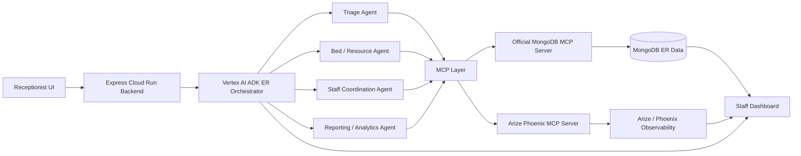

# Rapid Handoff
Rapid Handoff: an multi agent system that coordinates ER triage, bed assignment, and staff dispatch in real time.

Made by Laasya Aki and Hana Benko for the Google Cloud Rapid Agent Hackathon in May and June of 2026.

## ER operations orchestrator

The TypeScript ADK agent in
`backend/src/agents/orchestrator_agent/agent.ts` routes operational questions
to tools for census, bottlenecks, staffing, bed capacity, and shift briefings.

1. Copy `.env.example` to `.env` and set the project and MongoDB values.
2. Enable the Vertex AI API and authenticate with Application Default Credentials:
   `gcloud auth application-default login`
3. Install dependencies with `pnpm install`.
4. Start the ADK development UI with `pnpm agent:dev`.

No Gemini API key is used. `GOOGLE_GENAI_USE_VERTEXAI=TRUE` selects Vertex AI.

## Node.js backend

The Express backend wraps the existing ADK agent without duplicating its
orchestration logic.

```bash
pnpm dev
pnpm typecheck
pnpm test
pnpm build
pnpm start
```

Routes:

- `GET /health`
- `POST /agent/orchestrate`
- `POST /tools/census`
- `POST /tools/bottlenecks`
- `POST /tools/staffing`
- `POST /tools/beds`
- `POST /tools/briefing`

See [docs/cloud-run.md](docs/cloud-run.md) for the staged Cloud Run deployment.

## Architecture



Phase 2 MCP details are in [docs/architecture.md](docs/architecture.md) and
tool schemas are in [docs/mcp-tools.md](docs/mcp-tools.md).
